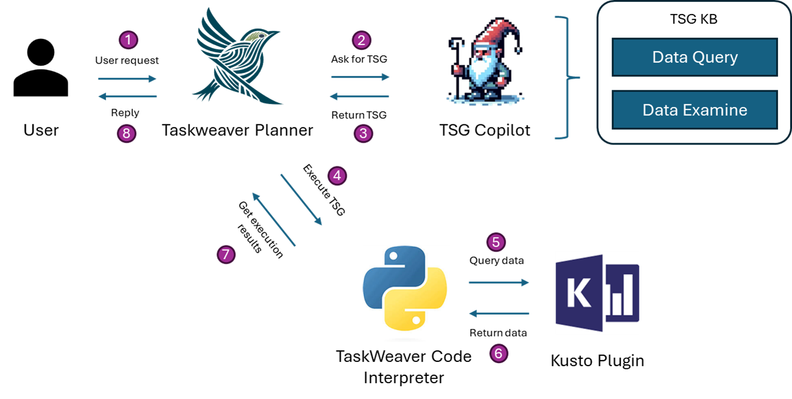

#  Nissist: An Incident Mitigation Copilot based on Troubleshooting Guides

This repository contains the offical implementations of our paper [Nissist: An Incident Mitigation Copilot based on Troubleshooting Guides](https://arxiv.org/abs/2402.17531). 

We are honored to be accepted by ECAI 2024 Demo Track.


## Nissist Setup

1. Create virtual environment
    
    Conda option:
    ```bash
    conda create -n tsgcopilot python=3.10
    conda activate tsgcopilot
    git clone **
    pip install -r requirements.txt
    ```
    Docker option:
    ```bash
    docker build -t tsgcopilot .
    docker run -p 2000:2000 tsgcopilot
    ```

2. Initialize the parameters for OpenAI and Kusto.

    You need to configure AOAI information before running the code.

    - copy `config_example.yaml` and rename to `config.yaml` and fill in your AOAI information and kusto information. Note that we offer two kusto login, if set `KUSTO_LOGIN` as `AAD`, you don't need to specify `KUSTO_SECRET`, `KUSTO_AAD_APP_ID`, and `KUSTO_AUTHORITY_ID`. If you donn't need KUSTO, just ignore it.
    - Note that the AOAI model needs to be new enough to support JSON format output, required to be version after 2023-10, refer to this [json mode](https://platform.openai.com/docs/guides/text-generation/json-mode)


3. Prepare Troubleshooting Guides

    We give an example of the TSG we use in `example_data/TSGs`.
    You need to convert your documents into the same structure, and please refer to **`tsg_reformulation`** folder for more details.

## Run Nissist

You can run Nissist on Terminal or Interactive UI.

### Run on Terminal
```bash
python TSG_Copilot.py
```

### Run On Interactive UI
The interactive UI is implemented on ChainLit package.
- Run the Nissist

    First, you should start your TSG_Copilot API service, that means firstly run ```python main.py```. And the service will listen on this port locally (**http://127.0.0.1:2000/api/tsg_copilot**).

    - Example request:
    ```json
    {
        "query": "I got a incident that ...?",
        "conversation_id": "10000"
    }
    ```

    Note: use the same *conversation_id* if you would like to continue the conversation.


- Run the Web UI
    
    After that, run the following script in terminal ```chainlit run app.py```, it will automatically open the webpage (**http://localhost:8000/**), and you can input your message to get the response of Nissist. 
    
    - The function ```send_message``` inside ```app.py``` will call the API you have started.

    - As your want to start a new round of conversation, you can type 'exit' or just start 'New Chat'.


## Intergrate Nissist into Taskweaver for Automation



1. Start up Nissist as the backend service, refer to `Run On Interactive UI`.

2. Clone and install the latest version of [TaskWeaver](https://github.com/microsoft/TaskWeaver).

3. Copy the `ext_role/tsg_copilot` directory to the TaskWeaver as the  `taskweaver/ext_role/tsg_copilot` directory.

4. Copy all files in the `project/plugins` directory to the TaskWeaver  `project/plugins` directory.
    
    Here we provide an example of the Kusto plugins to automate the execution of Kusto Query. You are required to set the Kusto configurations in the `pull_kusto_data.yaml` file.

5. Copy all files in the `project/planner_examples` directory to the TaskWeaver  `project/planner_examples` directory.

6. Follow the instructions in the TaskWeaver [QuickStart](https://microsoft.github.io/TaskWeaver/docs/quickstart) to start the TaskWeaver console chat.

Note that we should add the below new lines in the configuration file `taskweaver_config.json`, besides the default LLM configurations.
```json
{
"session.roles": [
    "planner",
    "code_interpreter",
    "tsg_copilot"
],
"execution_service.kernel_mode": "local"
}
```

## Nissit Demo Video
A demo is also provided.

https://github.com/AL-377/Nissist-Demo/.asset/Nissist-demo.mp4

## Citation

If you find this paper or code useful, please cite us:
```
@article{an2024nissist,
  title={Nissist: An incident mitigation copilot based on troubleshooting guides},
  author={An, Kaikai and Yang, Fangkai and Li, Liqun and Ren, Zhixing and Huang, Hao and Wang, Lu and Zhao, Pu and Kang, Yu and Ding, Hua and Lin, Qingwei and others},
  journal={arXiv preprint arXiv:2402.17531},
  year={2024}
}
```